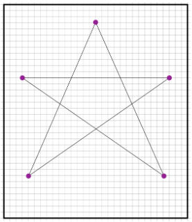

[codestudio]: <https://studio.code.org/s/csp1-2019/stage/6/puzzle/1/>
[ag]: <https://docs.google.com/document/d/15HWLX_JNHkY6ADLSu4X_rD_GjPzQe3HCUGbPU6YGv_8/edit?usp=sharing>
[worksheet]: <https://docs.google.com/document/d/1-ZqixweMKw4yaYvjl4k4yF8aqFmYTpNx-Dmue1huuWY/edit?usp=sharing>
[video]: <>

## Challenge:

Develop a *protocol* or set of rules for communicating a simple drawing to your partners using only numbers - then demonstrate that it works using the [Internet Simulator][codestudio].

### Challenge Rules:

* The image will be a line drawing created by connecting points on a grid, like the one seen here.
* You can discuss and agree on a protocol ahead of time, but the image exchange must happen without communication between the two parties other than through using the Internet Simulator.
* You can only send a single message - a single list of numbers - through the Internet Simulator to describe the whole image.

### Things to Consider:
* How will your points be formatted?
* How does the recipient know when one number ends and the next begins?

### Your Protocol:

Use your notebook to brainstorm ideas and then write down the steps in your protocol.

## Check Your Understanding

After developing and testing your protocol, complete the *Check your understanding* questions.
